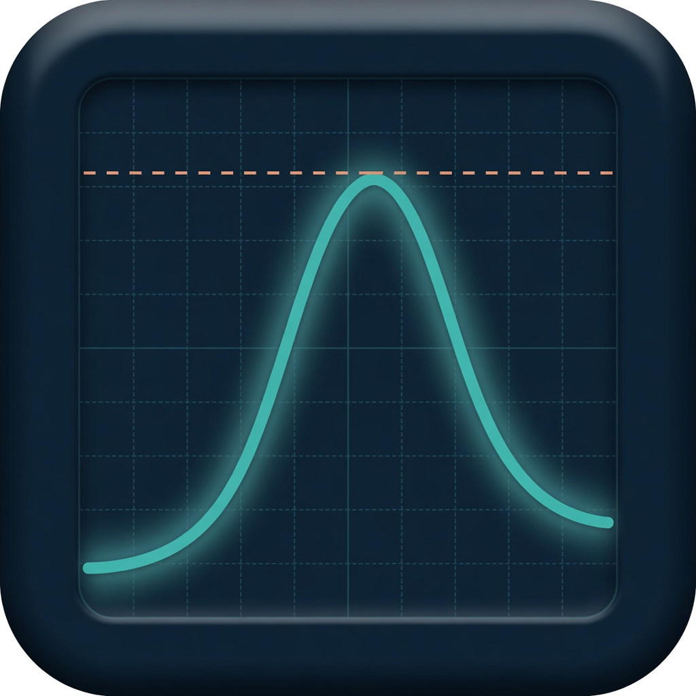

# Kinetica

Simulatore **locale** di farmacocinetica ormonale e peptidica per Windows.

[](LICENSE)
[](https://github.com/danielegabrovec/kinetica/releases)
[](https://github.com/danielegabrovec/kinetica/releases)

<p align="center">
  
</p>

**Autore:** [Daniele Gabrovec](https://github.com/danielegabrovec) — Biologo Nutrizionista (Ordine dei Biologi del Triveneto n. TRI_A2489).

> **Non è un dispositivo medico.** Non è marcato CE/FDA, non prescrive e non sostituisce giudizio clinico, RCP o laboratorio. I parametri PK sono stime da letteratura (evidenza A/B/C) con variabilità individuale ampia. Non usare le curve per iniziare, modificare o sospendere una terapia.

## Cosa fa

Kinetica costruisce curve di concentrazione nel tempo a partire da dose, frequenza, durata e formulazione:

- esteri del testosterone (enantato, cipionato, propionato, Sustanon, Nebido/TU, gel, patch…)
- estrogeni e progestinici
- asse (GnRH, hCG, clomifene…)
- tiroide, incretine, GH, peptidi

Il modello è a due costanti (Bateman / flip-flop per i depositi, infusione a ordine zero per gel e cerotti) con **superposition** delle dosi. I blend (Sustanon, Omnadren) sommano i componenti. Si possono adattare le curve a un prelievo (±%) e confrontare protocolli.

Dalla 1.1.0 i protocolli si organizzano in **cluster di simulazione** (curve indipendenti con colore e tratto propri) sovrapponibili sullo stesso grafico, con la serie **Δ** e il confronto Cavg/Cmax/Cmin tra Cluster 1 e Cluster 2.

La 1.2.0 aggiunge persistenza robusta con recupero e backup, import validato, report A4 professionali, accessibilità da tastiera, hardening Electron e una catena di rilascio verificabile.

**Tutto gira in locale:** nessun account, nessun cloud, nessun invio di dati.

## Installazione (Windows)

1. Apri la pagina [Releases](https://github.com/danielegabrovec/kinetica/releases).
2. Scarica `Kinetica-Setup-1.2.0.exe` e `SHA256SUMS.txt` (installer NSIS, 64 bit).
3. Esegui il file e segui la procedura (lingua italiana, si può scegliere la cartella).
4. All’avvio accetta l’avvertenza di simulazione.

Per verificare il file scaricato:

```powershell
Get-FileHash .\Kinetica-Setup-1.2.0.exe -Algorithm SHA256
Get-Content .\SHA256SUMS.txt
gh attestation verify .\Kinetica-Setup-1.2.0.exe -R danielegabrovec/kinetica
```

Il primo hash deve coincidere con quello pubblicato. L’ultimo comando è opzionale e richiede la [GitHub CLI](https://cli.github.com/).

### SmartScreen

L’installer **non è firmato con un certificato Authenticode a pagamento**. Windows può mostrare «Windows ha protetto il PC». Scegli **Ulteriori informazioni** → **Esegui comunque**. Il codice è pubblico in questo repository: si può compilare l’installer in proprio (vedi sotto).

### Disinstallazione

Impostazioni Windows → App → Kinetica → Disinstalla. I dati salvati restano in `%APPDATA%\Kinetica` finché non li cancelli a mano.

Requisiti: Windows 10 o 11, 64 bit.

## Avvio da codice (sviluppo)

Serve [Node.js](https://nodejs.org/) 22 o successivo.

```powershell
git clone https://github.com/danielegabrovec/kinetica.git
cd kinetica
npm ci
npm run verify
npm run dev
```

| Comando | Cosa fa |
|---|---|
| `npm run dev` | App Electron in modalità sviluppo |
| `npm test` | Suite Vitest del motore, import, persistenza ed export |
| `npm run test:e2e` | Build e collaudo dell’app Electron reale con Playwright |
| `npm run verify` | Typecheck, unit/integration, audit, build ed E2E |
| `npm run build` | Bundle produzione in `out/` |
| `npm run dist` | Bundle + installer NSIS in `release/` |
| `npm run smoke:installer -- "C:\\percorso\\Kinetica-Setup-x.y.z.exe"` | Installa, collauda e disinstalla il pacchetto reale in area temporanea |
| `npm run checksums` | Genera `release/SHA256SUMS.txt` |

## Come si usa

Layout da editor video:

| Zona | Contenuto |
|---|---|
| Sinistra | Libreria molecole (cerca, trascina sul grafico o sulle tracce) |
| Centro | Grafico concentrazione/tempo (linee Max / Media / Min accendibili) |
| Sotto il grafico | Tracce: ogni clip è una riga di protocollo |
| Destra | Ispettore della clip selezionata (molecola, dose, frequenza, durata, offset, adattamento %) |

- **Trascina** una molecola dalla libreria sulla timeline.
- **Tasto destro** su una clip: frequenza, molecola (con sottomenu esteri del testosterone), dose, durata, cestino. La ricerca nel menu funziona anche con accenti.
- **Trascina in orizzontale** per spostare (scatto 0,5 giorni: es. Sustanon 250 mg al giorno 1 e 100 mg a 3,5 giorni).
- **Trascina il bordo** per allungare/accorciare la durata.
- **Trascina in verticale** (maniglia) per alzare/abbassare la dose. L’altezza della clip segue la dose.
- **Cluster**: «Aggiungi cluster» crea un secondo gruppo di molecole con la sua curva; «Sovrapponi» le confronta sullo stesso grafico con la serie Δ.
- **Salva** (Ctrl+S), **Salva con nome** (Ctrl+Shift+S, mai sovrascrive), **Carica** (Ctrl+O), **Nuovo** (Ctrl+N). Il nome del protocollo si cambia cliccandolo in alto.
- **File**: elenco dei piani salvati con rinomina, duplica, elimina, **Importa/Esporta JSON** per passare un piano a un altro computer. Tutto sta in `%APPDATA%\Kinetica`.
- **Profili**: alias locali con peso, SHBG, albumina; il cambio profilo salva quello aperto.
- **Export:** HTML, PDF, stampa, CSV dalla sezione Report.

Frequenze: QID, TID, BID, ED, EOD, 6×/sett. … E3W, e custom.

## Motore PK

Codice puro in `src/shared/engine`, coperto da Vitest (`tests/`).

- `k_lenta` dalla t½ apparente; `k_rapida` dal Tmax; ampiezza dal Cmax di letteratura, poi proporzionale a dose e peso (Vd ∝ peso/70 kg).
- Se Tmax è oltre il massimo della Bateman (es. TU orale) si applica un lag.
- Blend = somma degli esteri, scalata sul Cmax del prodotto.
- T libero: formula di Vermeulen (opzionale).
- Adattamento laboratorio: fattore `scalePercent` sulla curva.

I parametri vivono in `src/shared/catalog/formulations.ts`. Evidenza **C** = illustrativa, non precisione finta.

## Dati e privacy

Nessuna telemetria, nessun account e nessuna rete richiesta dopo l’installazione. Anche i font sono inclusi localmente.

Persistenza: `%APPDATA%\Kinetica\library.json`. Le scritture sono atomiche; prima di aggiornare l’archivio viene conservato un backup. Se il JSON non è leggibile, Kinetica ne crea una copia `library.recovery-*.json`, riparte in sicurezza e mostra un avviso. Gli archivi delle versioni future non vengono modificati.

## Compilare l’installer

Da Windows, nella cartella del repo:

```powershell
npm ci
npm run verify
npm run dist
npm run checksums
```

L’eseguibile esce in `release\Kinetica-Setup-1.2.0.exe` con il relativo `release\SHA256SUMS.txt`.

## Struttura

```
src/main          processo Electron (file, stampa, PDF)
src/preload       bridge IPC
src/renderer      UI React
src/shared/engine motore PK (Bateman, superposition, metriche)
src/shared/catalog formulazioni, frequenze, preset, testi
tests             Vitest + collaudi E2E Electron
scripts           bootstrap Electron e checksum release
build             icona e risorse installer
```

Stack: Electron + Vite + React 19 + TypeScript + Tailwind v4 + ECharts + Zustand.

## Licenza

[MIT](LICENSE) © 2026 Daniele Gabrovec. Attribuzione richiesta. Nessuna garanzia. Non è un dispositivo medico.

## Contatti

- Autore: Daniele Gabrovec
- PEC / email: info.dottdanielegabrovec@gmail.com
- Codice: https://github.com/danielegabrovec/kinetica
